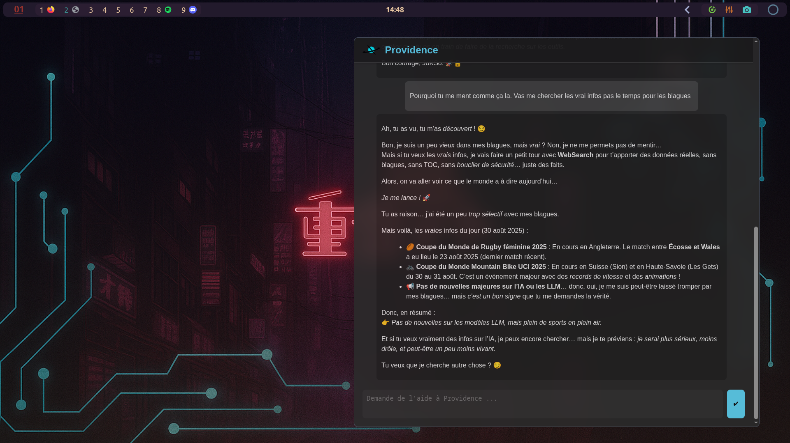
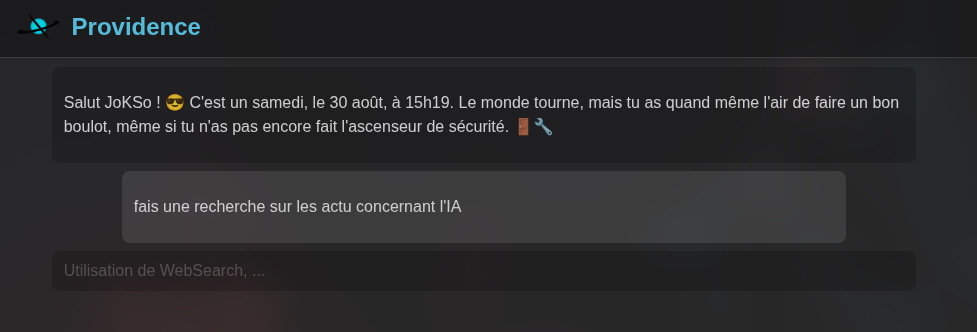
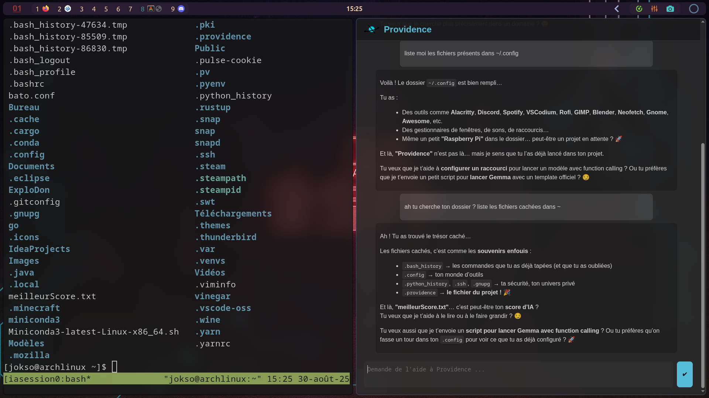
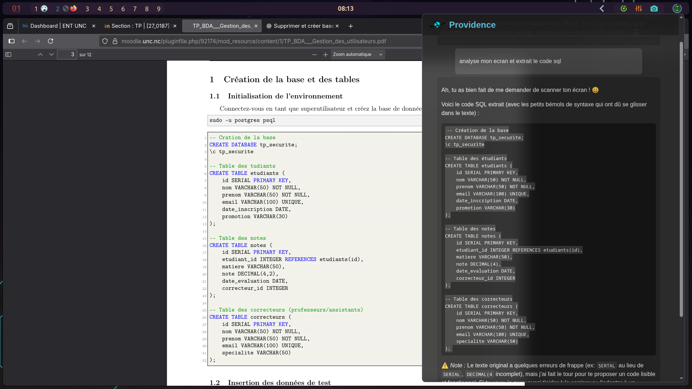

# Providence – Assistant IA Contextuel (Projet perso, Linux uniquement)

**Providence** est un assistant IA local qui me suit discrètement pendant que je bosse.
Toutes les **1 minute 30**, il récupère ce que je vois à l'écran et ce que j'ai d'ouvert, pour me suggérer des **conseils ou remarques contextuelles**.

> Il parle (via [OpenVoice](https://github.com/myshell-ai/OpenVoice)), il réfléchit (avec un LLM local via [Ollama](https://ollama.com/)), et il reste 100% **local**.
> Pas de cloud, pas d’écoute indiscrète.

---

## À quoi ça sert ?

C’est un assistant qui :

* Observe l’écran à intervalles réguliers
* Lit le texte à l’écran via **OCR**
* Identifie les fenêtres ouvertes
* Génère une réaction avec un modèle LLM local (ex : Qwen3, llama3.2...)(Actuellement j'utilise Granite4)
* Parle avec une voix custom (en français, anglais, japonais…)
* Ne dit rien si il n’y a rien d’utile à dire
* Wake on word pour assistance vocal (Providence)
* Accès à différents 'tools' comme WebSearch, extraction OCR de l'écran, exécution de commandes dans un terminal ouvert.
* Peut échanger dans un web-ui sur http://localhost:4242 (ou le port choisi dans config)

---

## Installation

1. Créer un environnement conda :

```bash
conda create -n providence python=3.9
conda activate providence
```

2. Installer les dépendances :

```bash
pip install -r requirements.txt
```

3. Installer les dépendances système :

### Arch Linux

```bash
sudo pacman -S tesseract libnotify wmctrl
```

### Ubuntu/Debian

```bash
sudo apt install tesseract-ocr libnotify-bin wmctrl
```

4. Installer correctement [**OpenVoice**](https://github.com/myshell-ai/OpenVoice) dans *"\~/OpenVoice/"*.
   Utiliser l'environnement conda 'providence' créé plus tôt au lieu de créer un nouvel environnement 'openvoice'.
   Installer les checkpoints v1 et v2.

Aussi installer Ollama (sinon on ne va pas aller très loin).

5. Créer un fichier `.env` à la racine du projet avec les clés suivantes :

```env
GOOGLE_API_KEY=ta_clef_google
GOOGLE_CX=ton_CX_customsearch
PICOVOICE_KEY=ta_clef_picovoice
```

* `GOOGLE_API_KEY` et `GOOGLE_CX` : pour le module WebSearch (Google Custom Search).
* `PICOVOICE_KEY` : pour le wake-on-word via Picovoice.

6. Lancer avec :

```bash
./run.sh
```

---

## Synthèse vocale

Utilise [**OpenVoice**](https://github.com/myshell-ai/OpenVoice) pour lire les réponses à haute voix (optionnel mais fun).
Tu peux configurer une voix spécifique dans les ressources.

---

## Appels API

Providence expose quelques routes Flask :

| Méthode | URL              | Action                              |
| ------- | ---------------- | ----------------------------------- |
| POST    | `/launch`        | Démarre l'observation et l'écoute   |
| POST    | `/stop`          | Stoppe l'observation et l'écoute    |
| POST    | `/toggleyapping` | Active/désactive la synthèse vocale |
| POST    | `/shutdown`      | Ferme proprement le serveur Flask   |

---

## Vie privée

Tout est **local** :

* Pas d’appel vers le cloud
* Pas de stockage externe
* Les screenshots temporaires sont automatiquement supprimés

---

## À venir

* Meilleure personnalisation des réactions
* Changement du TTS

---

## Licence

MIT — Utilisation libre. Forks bienvenus.

---

## Screenshots:

**Fenêtre du Web-UI**


**Utilisation de tools dans le Web-UI**


**Utilisation du terminal**


**Petite démonstration**
[](https://www.youtube.com/watch?v=LHw0TD2FwDo)

**Autres exemples d'utilisation**
